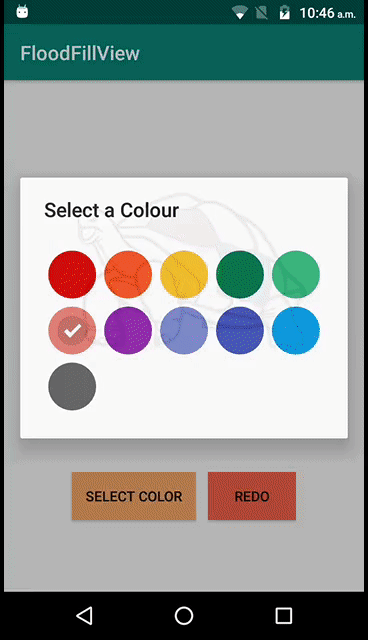

<!-- Library Logo -->


<!-- Buy me a cup of coffe 
<a href='https://ko-fi.com/A406JCM' style='margin:13px;' target='_blank' align="right"></a>
<a href='https://play.google.com/store/apps/details?id=com.vansuita.materialabout.sample&pcampaignid=MKT-Other-global-all-co-prtnr-py-PartBadge-Mar2515-1' target='_blank' align="right"></a>-->

# FloodFillView


This is a **FloodFillView** project. You can add in Your project and easily usable View. This Library Fill Selcted color in Bitmap That Set in View.

</br>
</br>

# app
 This library has a lot more customization and features like Undo, All Clear Etc. than is able to show here. Please check the sample app.


<!--

[](https://appetize.io/embed/3b4dpd5kv90mpa67mp5h8mugc0?device=nexus7&scale=50&autoplay=true&orientation=portrait&deviceColor=black) [](http://apk-dl.com/dl/com.vansuita.materialabout.sample) 
 [](https://www.codacy.com/app/jrvansuita/MaterialAbout?utm_source=github.com&amp;utm_medium=referral&amp;utm_content=jrvansuita/MaterialAbout&amp;utm_campaign=Badge_Grade) 
 <a target="_blank" href="https://developer.android.com/reference/android/os/Build.VERSION_CODES.html#GINGERBREAD"></a> -->


<p align="center">

</p>


# Setup

This library requires `minSdkVersion` to be set to `14` or above.

#### Step #1. Add the JitPack repository to your build file:

```gradle
allprojects {
    repositories {
	...
	maven { url "https://jitpack.io" }
    }
}
```

#### Step #2. Add the dependency ([See latest release](https://jitpack.io/#sendy50/FloodFillView)).

```groovy
dependencies {
       implementation 'com.github.sendy50:FloodFillView:1.0'
}
```
# Implementation

Create a **AboutView** instance with **AboutBuilder**.
```java
 // FindViewById of FloodFillView
 FloodFillView floodFillView = (FloodFillView) findViewById(R.id.flood_fill_view);
 floodFillView.setMaxZoom(15);
 
 //init Bitmap
 BitmapFactory.Options o = new BitmapFactory.Options();
 o.inScaled = false;
 
 //for Drawable
 originalBitmap = BitmapFactory.decodeResource(getResources(), R.drawable.animal10, o);
 
 //for Image Path
 originalBitmap = BitmapFactory.decodeFile(ImagePath, o);
 
 floodFillView.setImageBitmap(originalBitmap);
 currentBitmap = originalBitmap.copy(originalBitmap.getConfig(), true);
 
 //OnTouch 
 floodFillView.setOnTouchListener(new View.OnTouchListener() {
            @Override
            public boolean onTouch(View v, MotionEvent event) {
                switch (event.getAction()) {
                    case MotionEvent.ACTION_UP:
                        currentX = (int) event.getX();
                        currentY = (int) event.getY();

                        float devVsImgRatio = mIvImage.drawableWidthForDeviceRelated / originalBitmap.getWidth();
                        PointF point = mIvImage.transformCoordTouchToBitmap(event.getX(), event.getY(), true);
                        currentX = (int) (point.x / devVsImgRatio);
                        currentY = (int) (point.y / devVsImgRatio);
                        Bitmap bitmap = currentBitmap;
                       
					    //mSelectedColor = init your Color..
					    floodFillView.FloodFill(bitmap, currentX, currentY, mSelectedColor, Color.BLACK, 0);
						
						//After Set Bitmap to floodFillView
                        floodFillView.setImageBitmap(bitmap);
                       
					   break;
                }
                return true;
            }
        });
		
		
 //For Redo
 Bitmap bitmapo = currentBitmap;
 floodFillView.Redu(bitmapo, Color.WHITE, Color.BLACK, 0);
 floodFillView.setImageBitmap(bitmapo);
 
 //For All Clear
 Bitmap bitmapo = currentBitmap;
 floodFillView.AllClear(bitmapo);
 floodFillView.setImageBitmap(bitmapo);
 
 
 //For ZOOM IN and OUT
 floodFillView.setZoom(floodFillView.getCurrentZoom() - 1);
 floodFillView.setZoom(floodFillView.getCurrentZoom() + 1);
 
 //For Eraser
 mSelectedColor = Color.WHITE;
		
```


# Credit 
[Lakmal Weerasekara](https://github.com/lakmalz)
